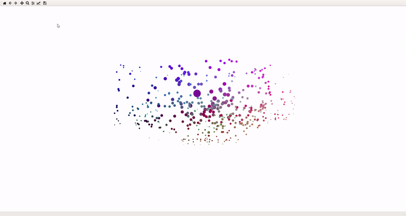

<h1 align="center">Welcome to Color Plotter 👋</h1>
<p>
  
  <a href="https://www.mit.edu/~amini/LICENSE.md" target="_blank">
    
  </a>
</p>

> A python script that ask for a color or its hexadecimal value and shows around 200 hundred similar colors

## Install

```python
pip install -r requeriments.txt
```

## Usage

```python
python src/closest_color.py
```

Enter a color from the [colors list](https://xkcd.com/color/rgb/) or just enter an hexadecimal value

## Run tests

```python
python -m unittest discover test/
```

## ✨ Demo

+ ## Purple




+ ## Light Green


+ ## Orange


## Author

👤 **Víctor Martínez**

* Github: [@JasterV](https://github.com/JasterV)
* LinkedIn: [@Víctor Martínez](https://www.linkedin.com/in/v%C3%ADctor-mart%C3%ADnez-3b8304196/)

## Show your support

Give a ⭐️ if this project helped you!

## 📝 License

Copyright © 2020 [Víctor Martínez](https://github.com/JasterV).<br />
This project is [MIT License](https://www.mit.edu/~amini/LICENSE.md) licensed.

***
_This README was generated with ❤️ by [readme-md-generator](https://github.com/kefranabg/readme-md-generator)_
